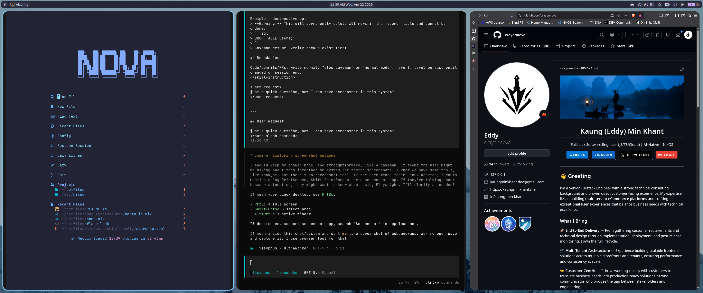

# dotfiles

Personal dotfiles repo built around Nix flakes and Home Manager.



It captures my daily personal and development setup across multiple users and machines, with flake-pinned inputs for reproducible Linux environments, especially NixOS. Desktop setups are centered on Wayland with Niri, while most application configs still live under `stow/` so they can be linked by Home Manager or used manually with GNU Stow when needed.

[](https://codespaces.new/crayonnova/dotfiles/tree/codespaces)

## Repository structure

```text
dotfiles/
├── flake.nix                    # Flake entrypoint; defines Home Manager targets and composes shared, user, and profile modules.
├── flake.lock                   # Locked upstream inputs such as nixpkgs, home-manager, niri, and noctalia.
├── home.nix                     # Shared Home Manager base; defines `myconfig` options and imports repo modules.
├── README.md                    # Top-level repo guide.
│
├── modules/                     # Reusable Home Manager modules grouped by concern.
│   ├── base/                    # Core shell, CLI tool, and package definitions.
│   ├── features/                # Optional feature modules such as dev tools, desktop apps, fonts, and Noctalia.
│   ├── system/                  # Environment-specific overrides such as Codespaces.
│   └── wayland/                 # Wayland desktop modules, including Niri and related tools.
│
├── profiles/                    # Feature presets for desktop, CLI-only, and Codespaces setups.
├── users/                       # Per-user identity modules with username and Home Manager state version.
├── stow/                        # GNU Stow-compatible dotfile source tree mirrored to home-directory paths.
│   ├── alacritty/               # Alacritty terminal config.
│   ├── fuzzel/                  # Fuzzel launcher config.
│   ├── niri/                    # Niri compositor config.
│   ├── noctalia/                # Noctalia shell config.
│   ├── nvim/                    # Neovim config.
│   ├── opencode/                # OpenCode config.
│   ├── starship/                # Starship prompt config.
│   ├── tmux/                    # tmux config.
│   └── wezterm/                 # WezTerm config.
│
├── scripts/                     # Helper scripts used by shell aliases and local workflows.
└── .devcontainer/               # Codespaces/devcontainer bootstrap files.
```

## How repo is composed

- `flake.nix` declares Home Manager outputs for different user@host targets.
- `users/*.nix` provides identity-specific values such as username and state version.
- `profiles/*.nix` toggles high-level feature sets like desktop, devtools, software, and fonts.
- `home.nix` imports shared modules from `modules/`.
- Many modules link config files from `stow/` with Home Manager, while `stow/README.md` keeps manual Stow usage available as fallback.

## Notes

- Main target platform is `x86_64-linux`, with NixOS-oriented workflows and a Codespaces profile.
- Desktop path uses Wayland with Niri, plus companion tools like fuzzel, swaylock, swayidle, mako, grim, and slurp.
- Reproducibility comes from flake-pinned package inputs; most user-facing app configs are stored in this repo and linked into place.

Feel free to explore repo, and ping me if you want to chat about any part of it.
